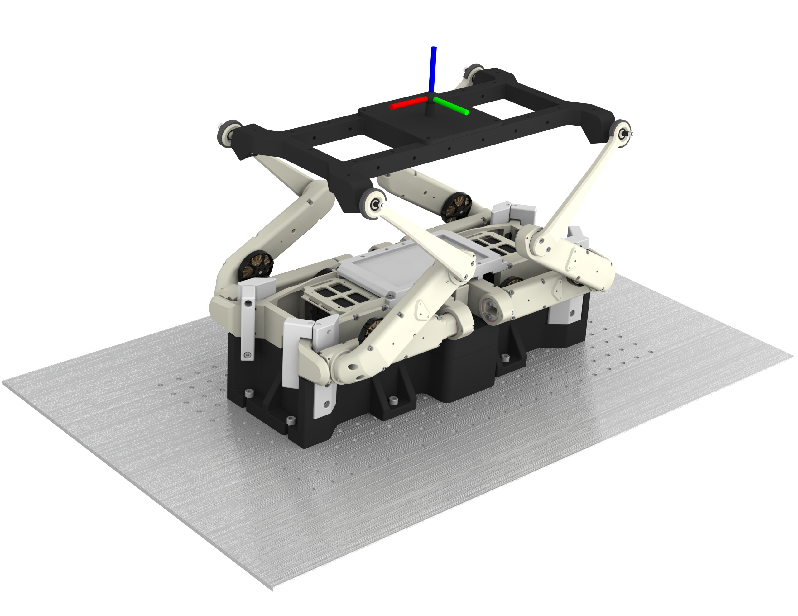

# SOLO 6 DoF Motion Platform

<!--  -->

<!-- 

  
   

 -->

  

## <u>Introduction</u>
We present a new open-source Six Degrees of Freedom (DoF) motion platform that is capable of producing controlled high frequency motion (surge, heave, sway, roll, pitch, and yaw) in 3D space. We introduce and implement the unique idea of flipping a quadruped robot, attaching a modular 3D printed platform (holding the payload) to the feet, and using inverse kinematics to move the attached platform by using the feet as end-effectors in the closed-loop kinematic chain.

1. [Hardware Framework](docs/hardware_framework.md)
2. [Software Framework](docs/software_framework.md)
3. [Setup and Usage](docs/setup_and_usage.md)
4. [Program Execution](docs/program_execution.md)

## <u>About the Creaters</u>
The SOLO 6 DoF Motion Platform was created at the [Dynamic Locomotion Group](https://dlg.is.mpg.de) at the [Max-Planck Institute for Intelligent Systems](https://is.mpg.de) by: 
- Nayan Man Singh Pradhan
- Patrick Frank
- An Mo
- Alexander Badri-Sprowitz

## <u>Link to Paper</u>

## <u>Referencing the Project and Paper</u>
You can reference the project with the following citation:
