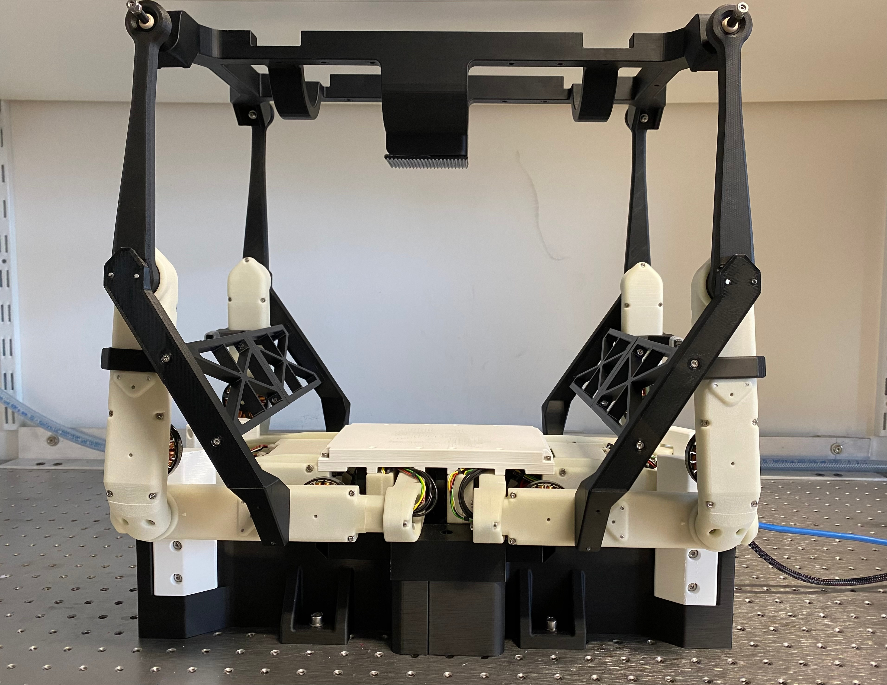
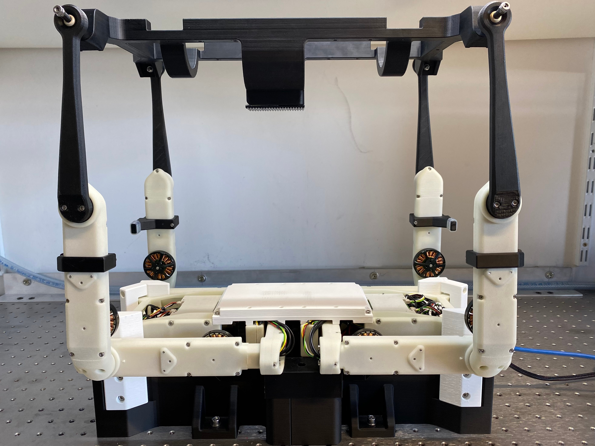
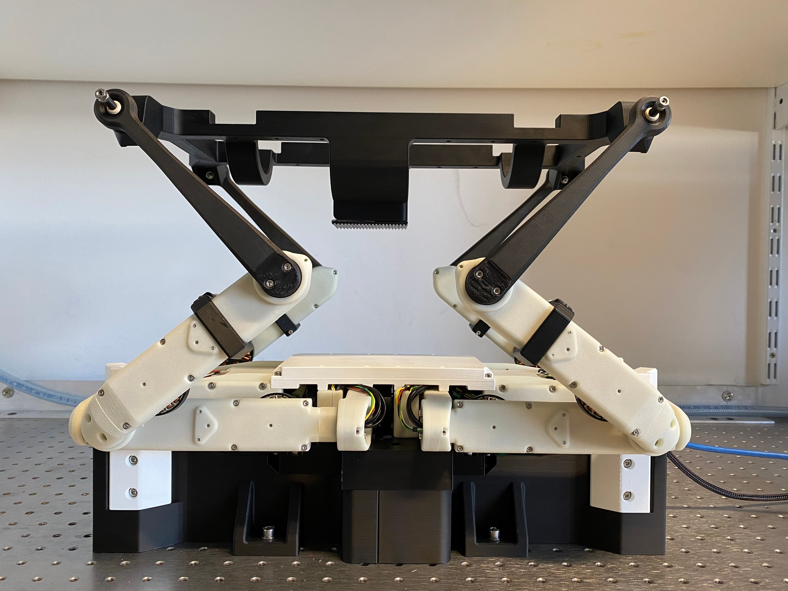
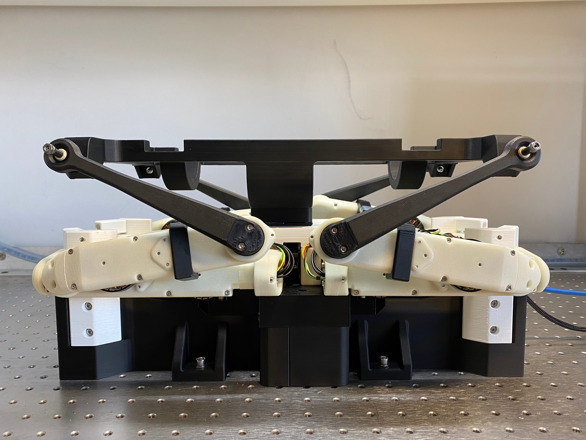

# Calibration and Usage

1. [Calibration Process](#calibration-process)
2. [Robot Behaviour](#robot-behaviour)
3. [Robot Positions](#robot-positions)

---

<a name="calibration-process"></a>

### Calibration Process
Calibration is essential for using the physical SOLO robot motion platform. 

#### Calibration Phase 0
Phase 0 calibration initializes the motors and the masterboard. The goal of phase 0 calibration is to use the calibration tools to initialize the robot motors at the [zero position](#zero-position). The program ends automatically after completion of calibration phase 0. This step should take less than 5 seconds. Please restart power supply and re-do phase 0 if it takes more than 5 seconds.
**Steps:**
1. Attach calibration tools with power supply OFF.
2. Turn power supply ON. 
3. Run the program with the phase 0 calibration flag. The flags for the type of sequence and inverse kinematics does not matter in this step. 
    ```
    bash start_program.sh -s 0 -i 0 -c s -p 0
    ```
4. Remove calibration tools. Keep power supply ON.

#### Calibration Phase 1
Phase 1 calibration should be executed after phase 0 calibration. Phase 1 calibration finds the indices of the motors from the zero position (set at phase 0). Phase 1 calibration moves all the four hip motors, lower leg motors, and upper leg motors in a synchronized manner until either all the four corresponding motor indices are found or until the set maximum and minimum motor angle variable is reached in both directions respectively. Currently, the maximum motor angle is 25&deg; and minimum motor angle is -25&deg;. If all motor indices are found, the final indices calibration array is saved in the csv file: `src/data_files/calibration_files/solo_phase1_calibrated_offsets.csv`. If all motor indices are not found, there is something wrong in the calibration step. Turning OFF and then turning ON the power supply and re-doing the calibration process (from phase 0) should solve the issue. After saving the motor indices, the motion platform is smoothly placed on the robot body by the `smooth_landing` method. The program ends automatically after completion of calibration phase 1.

After completing phase 1 once, the csv file: 'src/data_files/calibration_files/solo_phase1_calibrated_offsets.csv' should be filled. If no changes are made to the hardware of the robot, phase 0 and phase 1 do not need to be repeated as long as the csv file: 'src/data_files/calibration_files/solo_phase1_calibrated_offsets.csv' is filled.
**Steps:**
1. Make sure the calibration tools are removed.
2. After calibration tools are removed, run the script with the phase 1 calibration flag. The flags for the type of sequence and inverse kinematics does not matter in this step. 
    ```
    bash start_program.sh -s 0 -i 0 -c s -p 1
    ```
3. Turn power supply OFF.

#### Calibration Phase 2
Phase 2 calibration should be executed only after the csv file: 'src/data_files/calibration_files/solo_phase1_calibrated_offsets.csv' is filled. It is important to only start phase 2 calibration when the motor joints are close to the zero position (from phase 0). Therefore, the platform has to be lifted all the way up. This position is called the [calibration position](#calibration-position). The calibration tools should NOT be attached. The power supply must be off when the motors are moved to the calibration position. After the motors are in the calibration position, the power supply should be turned on and the script can be executed. Calibration phase 2 finds the new current motor indices (they are different because every time the power supply is turned ON, it saves that position as the zero position), calculates the offset to the calibrated motor indices from phase 1 calibration, saves the landing position using the free solo control mode, and finally uses the offset such that the zero position is always maintained and consistent. The offset values from calibration phase 2 are saved in the csv file: 'src/data_files/calibration_files/solo_phase2_calibrated_offsets.csv' and the landing position is saved in the csv file: 'src/data_files/calibration_files/solo_landing_pos.csv'.
**Steps:**
1. Make sure the calibration tools are removed.
2. Make sure the power supply is OFF.
3. Manually lift the platform high up such that the robot and motors are in the calibration position.
4. After robot and motors are in the calibration position, turn power supply ON.
5. Run the script with the phase 2 calibration flag. The flags for the type of sequence and inverse kinematics does not matterr in this step too. After completing calibration phase 2, the robot goes into the free solo control mode. 
    ```
    bash start_program.sh -s s -i p -c s -p 2
    ```
6. After finding the calibration indices in phase 2, the robot interpolates to the proper calibrated zero position and starts the free solo control class. This allows the user to move the platform around without the exerting any external torque. 
7. When you start to see the joint angles printing in the screen, move the platform to the [landing position](#landing-position). 
8. After the platform is set to the  [landing position](#landing-position), press the ADC trigger button. This will save the landing position (with the offset) into the csv file: 'src/data_files/calibration_files/solo_landing_pos.csv'.
9. Press `ctrl+c` to exit from the program.

It is important to run calibration phase 2 once every time after the power supply is restarted. If the power supply has not been restarted and if calibration phase 2 has already been executed once at the start of this test run, there is no need to run the calibration phase 2 again. After completing phase 2 once, you can run the steps below without having to manually adjust the position of the platform or robot. 

#### Calibration Phase X
**Steps if calibration step 2 has already been executed once after power supply has been turned ON:**
1. Make sure that calibration phase 2 has already been executed once at the beginning of the current test run.
2. The solo robot should be in [landing position](#landing-position).
3. The power supply should be ON. If power supply is OFF, you must run calibration phase 2 as detailed above and you should not continue with the steps below.
4. If power supply is ON, you can run the script with the no calibration flag. If you have already generated your motion trajectory, you can use the pre-existing inverse kinematics flag. If not, use the flags according to the platform motion you want to execute. 
    ```
    bash start_program.sh -s s -i p -c s -p x
    ```

---

<a name="robot-positions"></a>

### Robot Positions
#### Zero position
Configuration of Robot when calibration tools are attached at Calibration Phase 0.
<p align="center">
    
</p>

#### Calibration position
Configuration of Robot when calibration tools are not attached and before starting Calibration Phase
<p align="center">
    
</p> 

#### Home position
Configuration of Robot when no sequence is given or when Robot is waiting for ADC trigger. 
<p align="center">
    
</p> 

#### Landing position
Configuration of Robot after completing smooth landing.
<p align="center">
    
</p> 

---

<a name="robot-behaviour"></a>

### Robot Behaviour and Usage
After completing the hardware and software setup, you are ready to use our SOLO 6 DoF Motion Platform. Refer to the [Program Execution](./program_execution.md) Section for starting and using the robot.  

A high level overview of the software steps and expected robot behaviour is as following:
1. Hardware Setup is completed (Refer to [Hardware Setup](#hardware-setup)). 
2. Software Setup is completed (Refer to [Software Setup](#software-setup)). 
3. Realtime OS Setup is completed (Refer to [Realtime OS Setup](#realtime-os-setup)).
4. Robot calibration phase 0 and calibration phase 1 are completed (refer to [Calibration Process](#calibration-process)).
5. The user runs a program with the SOLO control environemnt (refer to [Program Execution](./program_execution.md)).
6. If calibration phase 2 is not completed, the user runs calibration phase 2. Then the landing position is set (refer to [Calibration Position](#calibration-process). 
7. The user runs the program with calibration phase x from landing position.
8. From the landing position, the robot goes to home position (refer to [Robot Positions](robot-positions)) through a smooth linear interpolation trajectory. If the correct motor indices are not found, the home position has an offset and does not look like the image in [Robot Positions](robot-positions).
9. The robot stays in the home position and waits for the ADC button trigger signal. 
10. After receiving the ADC button trigger signal, the robot waits for 2 seconds as a safety mechanism. Then the robot starts to move our 6 DoF Motion Platform in the commanded motion trajectory. 
11. After completing the commanded motion trajectory, the robot places the motion platform in the landing position (refer to [Robot Positions](robot-positions)) through a smooth linear interpolation trajectory. 
12. The data will be processed (time of processing data depends on the runtime of the motion platform and length of commanded motion trajectory).
13. The processed data will be visualized through plots and graphs. 
14. The program ends.

