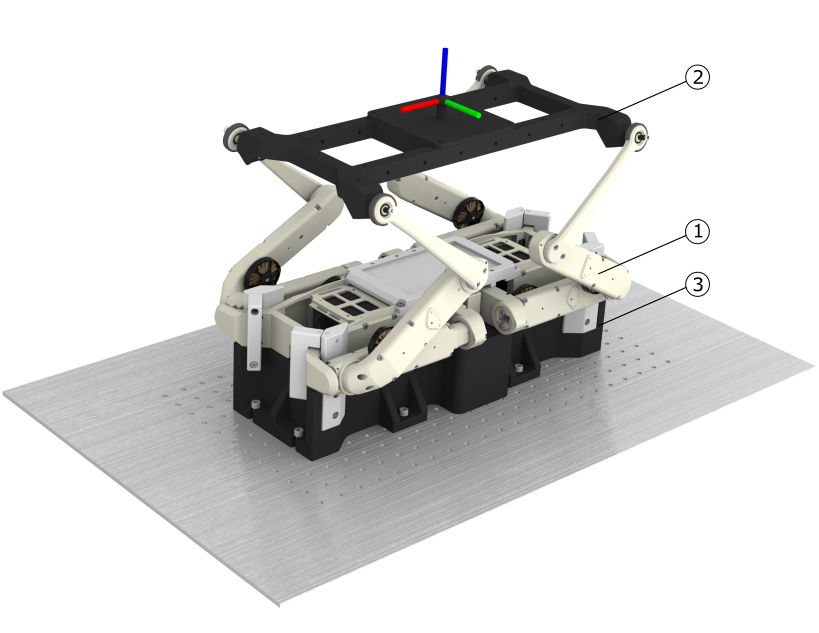
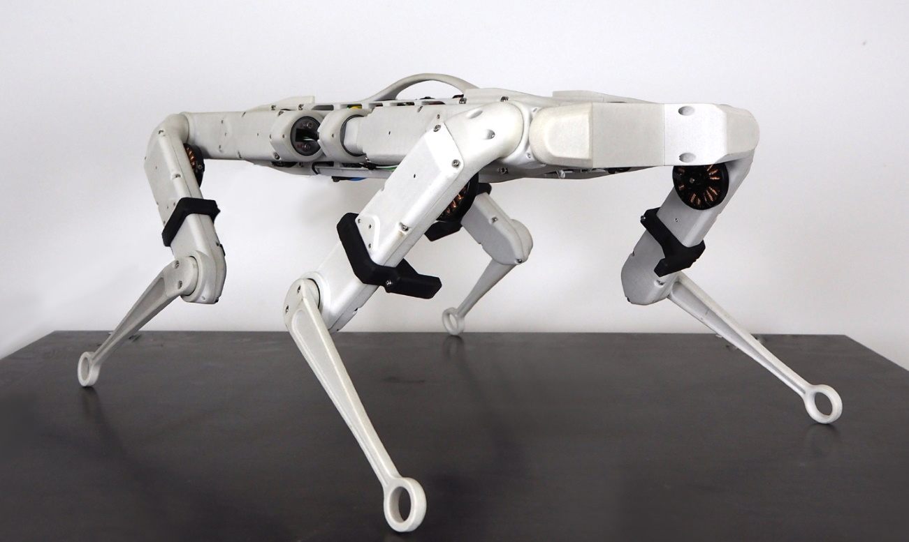
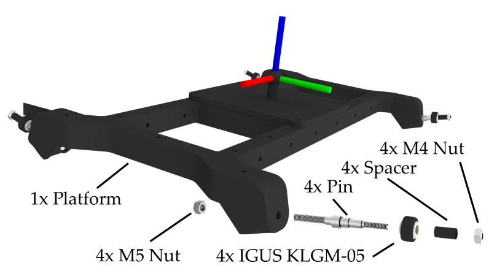
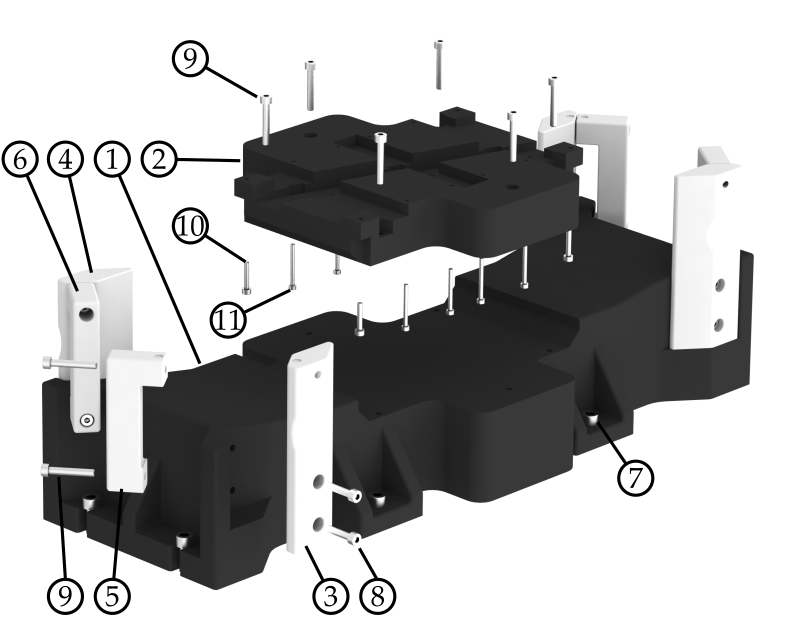

# Hardware Framework

  

The hardware framework consists of three main components: 
1. the SOLO robot,
2. the platform attached to the legs of the SOLO robot, and
3. the base component that makes sure the robot is fixed to a table.

The figure above shows the robot fixed to an optic table with the attached platform.

### 1. SOLO robot
The SOLO 12 Robot is a quadruped robot (assembled from four legs) of total mass $2.2$ kg with a torque-controller for tracking full-body motions computed with a kino-dynamic motion optimizer \cite{herzog2016structured} \cite{ponton2018time}. The brushless actuator module used in the SOLO robot consists of a $9:1$ dual-stage timing belt transmission, a high-resolution optical encoder, and a $5000$ count-per-revolution code wheel mounted directly on the motor shaft. The desired joint torques are converted into desired motor current using the relationship $\tau_{joint}=k_{i}iN$ where $k_{i}=0.025$ Nm/A and the gear reduction $N=9$ leading to a $\tau_{joint}=0.225i$. The actuators can output $\tau_{max}=2.7$ Nm joint torque at $12$ A. More information regarding the SOLO robot can be found in the Open Dynamic Robot Initiative [Website](https://open-dynamic-robot-initiative.github.io) and their [GitHub](https://github.com/open-dynamic-robot-initiative). 

    

Solo12 Quadruped Robot. Picture source: PAL robotics.

### 2. Platform Attached to Legs
The platform is mounted to the robot by four pins fixed to a spherical bearing. We used the [IGUS KGLM-05](https://www.igus.eu/product/388?C=DE&L=en&artNr=KGLM-05) spherical bearing with a maximum pivot angle of 30 degrees. These spherical bearings are press fitted to the robot legs and secured by M4 nuts on the platform. The platform itself is 3D printed while the pins are machined. There are multiple mounting points provided to attach something to the platform. All parts needed for the platform are shown in the figure below.

    

### 3. Base Component
To fix the robot during movement, we designed a base that is screwed on an optic table. The base consists of multiple parts, as shown in the figure below. We replaced the lower center plate of the robot with our design (No. 2), to be able to fix the robot on the base. The plate gets attached by four M3 and eight M2.5 screws to the robot and six M4 screws to the base. The base itself is fixed to the optic table by eight M6 Screws. To further support the robot base, we design clamps (No. 3, 4, 5, 6) that attach close to the hip of the robot.

    

The table below lists all the parts needed to build the base.
| No.           | Name      | Qty.  |
| :-----:       | ---     | :---: |
| 1  | Base | 1 |
| 2  | Plate Robot | 1  |
| 3 | Base Clamp | 2    |
| 4 | Base Clamp mirrored | 2   |
| 5 | Robot Clamp | 2   |
| 6 | Robot Clamp mirrored | 2  |
| 7 | SHC Screw M6x16 | 8   |
| 8 | SHC Screw M4x20 | 8   |
| 9 | SHC Screw M4x25 | 14  |
| 10 | SHC Screw M3x16 | 4  |
| 11 | SHC Screw M2.5x25 | 8  |
| 12 | HeliCoil M4 Thread Insert | 22   |