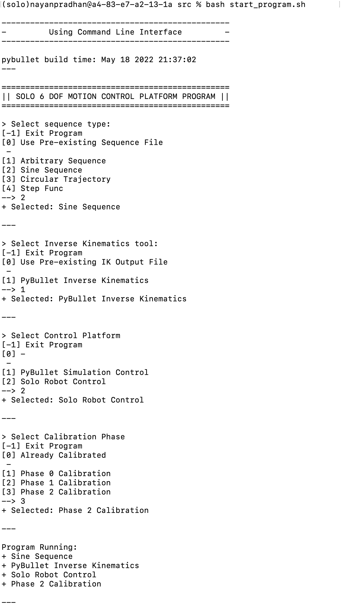
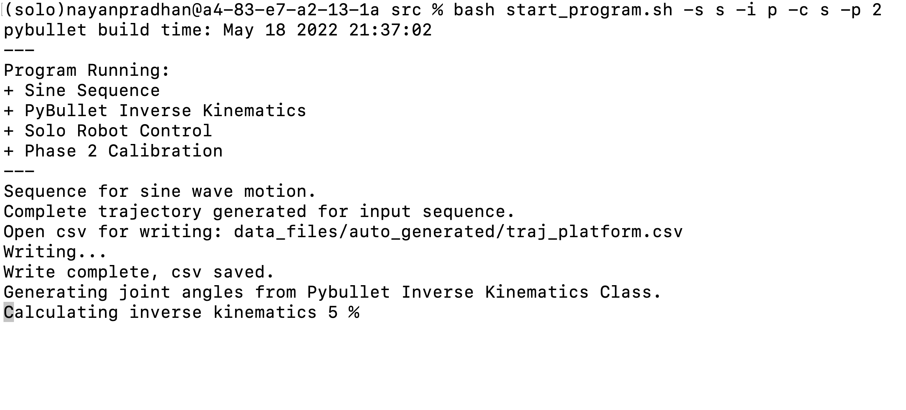

# Program Execution

## Instructions to run program
The software package can be executed using the Command Line Interface or the In-line Terminal Interface. 

---

## Command Line Interface
The command line interface offers a step-by-step interface that prompts the user for inputs on what program configuration the package should run. This method is convenient and recommended for users who are not familir with the software package.

`cd src`  
`bash start_program.sh`

### Example:
Example of running software configuration for: 
- Sine Sequence
- Pybullet Inverse Kinematics
- Solo Control Environment
- Phase 2 Calibration

  

---

## In-line Terminal Interface
The in-line terminal interface offers a one line quick and repeatable flag based command system for users who are familiar with the software package.

`cd src`  
`bash start_program.sh <flags>`

### In-line Terminal Interface `<flags>`
`-h`     Print help.  

`-s`     Define sequence type.  
&emsp; `0`   Use pre-existing sequence  
&emsp; `a`   Use arbitrary sequence  
&emsp; `s`   Use sine sequence  
&emsp; `c`   Use circular sequence  
&emsp; `t`   Use step sequence  
    
`-i`     Define inverse kinematics tool.  
&emsp;  `0`   Use pre-existing inverse kinematics  
&emsp;  `p`   Use pybullet inverse kinematics  
    
`-c`    Define control environment.  
&emsp; `p`   Use pybullet environment  
&emsp; `s`   Use solo robot environment  
    
`-p`     Define calibration phase.  
&emsp; `x`   Use no calibration  
&emsp; `0`   Calibration Phase 0  
&emsp; `1`   Calibration Phase 1  
&emsp; `2`   Calibration Phase 2   

### Example:
Example of running software configuration for: 
- Sine Sequence
- Pybullet Inverse Kinematics
- Solo Control Environment
- Phase 2 Calibration

  

