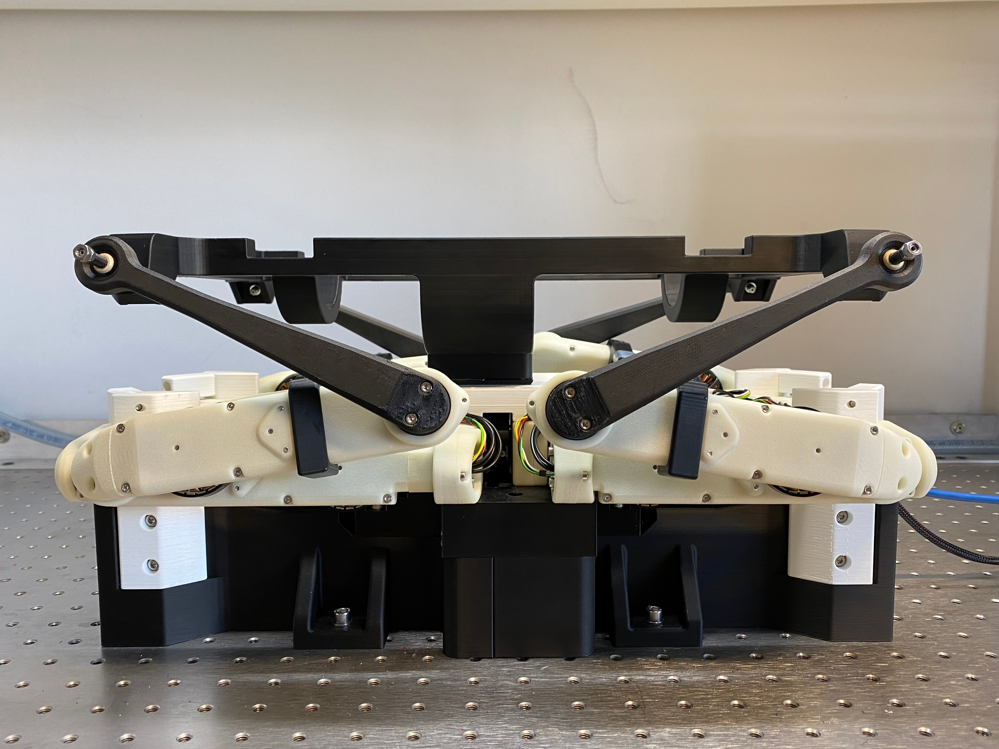

# Setup and Usage

1. [Hardware Setup](#hardware-setup)
2. [Software Setup](#software-setup)
3. [Realtime OS Setup](#realtime-os-setup)
4. [Calibration Process](#calibration-process)
5. [Robot Behaviour](#robot-behaviour)
6. [Robot Positions](#robot-positions)
7. [Known Issues and Solutions](#known-issues-and-solutions)
8. [Notes](#notes)

---

<a name="hardware-setup"></a>

### Hardware Setup
1. Refer to the [Open Robot Quadruped Robot 12 DoF](https://github.com/open-dynamic-robot-initiative/open_robot_actuator_hardware/blob/master/mechanics/quadruped_robot_12dof_v1/README.md#quadruped-robot-12dof-v1) for setting up the SOLO 12 Robot.
2. Refer to the [Hardware Framework](docs/hardware_framework.md) page for instructions on setting up the motion platform environment. 

---

<a name="software-setup"></a>

### Software Setup
1. Get and setup the [Open Dynamic Robot Initiative Masterboard SDK](https://github.com/open-dynamic-robot-initiative/master-board/blob/master/sdk/master_board_sdk/README.md) interface.
2. Clone the `solo-6dof-motion-platform` repository. 
    ```
    git clone https://github.com/nayan-pradhan/solo-6dof-motion-platform
    ```
3. Clone the Open Dynamic Robot Initiative Masterboard Git repository inside `solo-6dof-motion-platform/resources/`. 
    ```
    cd solo-6dof-motion-platform/resources/
    git clone --recursive https://github.com/open-dynamic-robot-initiative/master-board.git
    ```
4. Setup, build, and install necessary modules for the master-board package.
    ```
    cd master-board/sdk/master_board_sdk
    mkdir build
    cd build
    cmake -DBUILD_PYTHON_INTERFACE=ON -DCMAKE_BUILD_TYPE=Release -DPYTHON_EXECUTABLE=$(which python3) ..
    make
    sudo PYTHONPATH=./master-board/sdk/master_board_sdk/build pip3 install pybullet pynput
    ```

---

<a name="realtime-os-setup"></a>

### Realtime OS Setup

#### Install Linux and preempt RT patch.
1. Download and install Ubuntu. 
2. Install required dependencies.
    ```
    sudo apt install -y flex bison libssl-dev libelf-dev libncurses5-dev
    ```
3. Check kernel version. We are using version 5.15.0.
    ```
    uname -r
    ```
4. Download preempt RT patch (.patch.xz file) for your kernel version via this [link](https://wiki.linuxfoundation.org/realtime/preempt_rt_versions). We take the latest 5.15 kernel patch.
5. Download the kernel matching the preempt RT patch you just downloaded (.tar.xz file) via this [link](https://mirrors.edge.kernel.org/pub/linux/kernel/)
6. Extract the downloaded files.
    ```
    cd ~/Downloads/
    xz -d linux-YOURVERSION.tar.xz
    xz -d patch-YOURVERSION.patch.xz
    tar xf linux-YOURVERSION.tar
    ```
7. Change directory to kernel directory and apply patch. 
    ```
    cd linux-YOURVERSION/
    patch -p1 < ../patch-YOURVERSION.patch
    ```
8. Configure kernel.
    ```
    cp -v /boot/config-$(uname -r) .config
    make oldconfig
    ```
    For Preemption model choose: Fully Preemptible Kernel (Real-Time). For the rest use default settings by pressing enter.
    ```
    scripts/config --disable SYSTEM_TRUSTED_KEYS
    make x86_64_defconfig
    ```
9. Compile and install kernel.
    ```
    sudo make deb-pkg
    sudo make modules_install
    sudo make install
    ```
10. Update grub. 
    ```
    sudo update-initramfs -c -k YOURVERSION
    sudo update-grub
    ```
11. Reboot your system. 

#### Update Nvidia Driver
First try the easier way to install the driver, but it is not possible on some systems.
1. Download latest Nvidia driver from the [Nvidia website](https://www.nvidia.com/download/index.aspx).
2. Go to your Downloads folder, make file executable, and run the file. 
    ```
    cd ~/Downloads/
    chmod +x ./NVIDIAFILE.run
    sudo ./NVIDIAFILE.run
    ```
If this is not working and you get the error 'x server is running' or the message that Nvidia drivers will not work on realtime systems, try the following steps:
1.  Press Ctrl+Alt+F1 to open a Terminal and login with your credentials.
2.  Stop X-Server. 
    ```
    sudo systemctl stop lightdm
    ```
3. Install the driver. 
    ```
    cd ~/Downloads/
    sudo IGNORE_PREEMPT_RT_PRESENCE=1 bash ./NVIDIAFILE.run
    ```
4. Start X-Server.
    ```
    sudo systemctl start lightdm
    ```
5. Reboot your system. 

#### Configure your System
1. Create 'realtime' group and add users.
    ```
    sudo groupadd realtime
    sudo usermod -aG realtime <username>
    ```
2. Set rtprio and memlock limits.
    ```
    sudo tee /etc/security/limits.d/99-realtime.conf > /dev/null <<EOL
    @realtime - rtprio 99
    @realtime - memlock unlimited
    EOL
    ```
3. Reboot your system. 

--- 

<a name="calibration-process"></a>

### Calibration Process
Calibration is essential for using the physical SOLO robot motion platform. 

#### Calibration Phase 0
Phase 0 calibration initializes the motors and the masterboard. The goal of phase 0 calibration is to use the calibration tools to initialize the robot motors at the [zero position](#zero-position). The program ends automatically after completion of calibration phase 0. This step should take less than 5 seconds. Please restart power supply and re-do phase 0 if it takes more than 5 seconds.
**Steps:**
1. Attach calibration tools with power supply OFF.
2. Turn power supply ON. 
3. Run the program with the phase 0 calibration flag. The flags for the type of sequence and inverse kinematics does not matter in this step. 
    ```
    bash start_program.sh -s 0 -i 0 -c s -p 0
    ```
4. Remove calibration tools. Keep power supply ON.

#### Calibration Phase 1
Phase 1 calibration should be executed after phase 0 calibration. Phase 1 calibration finds the indices of the motors from the zero position (set at phase 0). Phase 1 calibration moves all the four hip motors, lower leg motors, and upper leg motors in a synchronized manner until either all the four corresponding motor indices are found or until the set maximum and minimum motor angle variable is reached in both directions respectively. Currently, the maximum motor angle is 25&deg; and minimum motor angle is -25&deg;. If all motor indices are found, the final indices calibration array is saved in the csv file: `src/data_files/calibration_files/solo_phase1_calibrated_offsets.csv`. If all motor indices are not found, there is something wrong in the calibration step. Turning OFF and then turning ON the power supply and re-doing the calibration process (from phase 0) should solve the issue. After saving the motor indices, the motion platform is smoothly placed on the robot body by the `smooth_landing` method. The program ends automatically after completion of calibration phase 1.

After completing phase 1 once, the csv file: 'src/data_files/calibration_files/solo_phase1_calibrated_offsets.csv' should be filled. If no changes are made to the hardware of the robot, phase 0 and phase 1 do not need to be repeated as long as the csv file: 'src/data_files/calibration_files/solo_phase1_calibrated_offsets.csv' is filled.
**Steps:**
1. Make sure the calibration tools are removed.
2. After calibration tools are removed, run the script with the phase 1 calibration flag. The flags for the type of sequence and inverse kinematics does not matter in this step. 
    ```
    bash start_program.sh -s 0 -i 0 -c s -p 1
    ```
3. Turn power supply OFF.

#### Calibration Phase 2
Phase 2 calibration should be executed only after the csv file: 'src/data_files/calibration_files/solo_phase1_calibrated_offsets.csv' is filled. It is important to only start phase 2 calibration when the motor joints are close to the zero position (from phase 0). Therefore, the platform has to be lifted all the way up. This position is called the calibration position. The calibration tools should not be attached. The power supply must be off when the motors are moved to the calibration position. After the motors are in the calibration position, the power supply should be turned on and the script can be executed. Calibration phase 2 finds the new current motor indices (they are different because every time the power supply is turned ON, it saves that position as the zero position), calculates the offset to the calibrated motor indices from phase 1 calibration, and uses the offset such that the zero position is always maintained and consistent. The offset values from calibration phase 2 are saved in the csv file: 'src/data_files/calibration_files/solo_phase2_calibrated_offsets.csv'. Then the robot goes to the home position and waits for the ADC trigger button. 
**Steps:**
1. Make sure the calibration tools are removed.
2. Make sure the power supply is OFF.
3. Manually lift the platform high up such that the robot and motors are in the calibration position.
4. After robot and motors are in the calibration position, turn power supply ON.
5. Run the script with the phase 2 calibration flag. The flags for the type of sequence and inverse kinematics matter in this step. After completing calibration phase 2, the robot waits in the home position for the ADC trigger. After the ADC is triggered, the robot starts the specified platform motion. 
    ```
    bash start_program.sh -s s -i p -c s -p 2
    ```

It is important to run calibration phase 2 once every time after the power supply is restarted. If the power supply has not been restarted and if calibration phase 2 has already been executed once at the start of this test run (if csv file: 'src/data_files/calibration_files/solo_phase2_calibrated_offsets.csv' is updated), there is no need to run the calibration phase 2 again. After completing phase 2 once, you can run the steps below without having to manually adjust the position of the platform or robot. The program starts by taking the current joint angles of the motors and moves to the home position by interpolating a linear joint angle target to the home position. 
**Steps if calibration step 2 has already been executed once after power supply has been turned ON:**
1. Make sure that calibration phase 2 has already been executed once at the beginning of the current test run.
2. The power supply should be ON. If power supply is OFF, you must run calibration phase 2 as detailed above and you should not continue with the steps below.
3. If power supply is ON, you can run the script with the no calibration flag.
    ```
    bash start_program.sh -s s -i p -c s -p x
    ```

---

<a name="robot-positions"></a>

### Robot Positions
#### Zero position
Configuration of Robot when calibration tools are attached at Calibration Phase 0.
<p align="center">
    
</p>

#### Calibration position
Configuration of Robot when calibration tools are not attached and before starting Calibration Phase
<p align="center">
    
</p> 

#### Home position
Configuration of Robot when no sequence is given or when Robot is waiting for ADC trigger. 
<p align="center">
    
</p> 

#### Landing position
Configuration of Robot after completing smooth landing.
<p align="center">
    
</p> 

---

<a name="robot-behaviour"></a>

### Robot Behaviour and Usage
After completing the hardware and software setup, you are ready to use our SOLO 6 DoF Motion Platform. Refer to the [Program Execution](./program_execution.md) Section for starting and using the robot.  

A high level overview of the software steps and expected robot behaviour is as following:
1. Hardware Setup is completed (Refer to [Hardware Setup](#hardware-setup)). 
2. Software Setup is completed (Refer to [Software Setup](#software-setup)). 
3. Realtime OS Setup is completed (Refer to [Realtime OS Setup](#realtime-os-setup)).
4. Robot calibration phase 0 and calibration phase 1 are completed (refer to [Calibration Process](#calibration-process)).
5. The user runs a program with the SOLO control environemnt (refer to [Program Execution](./program_execution.md)).
6. If calibration phase 2 is not completed, SOLO robot executes calibration phase 2. 
7. After finding the motor indices, the robot goes to home position (refer to [Robot Positions](robot-positions)) through a smooth linear interpolation trajectory. If the correct motor indices are not found, the home position has an offset and does not look like the image in [Robot Positions](robot-positions).
8. The robot stays in the home position and waits for the ADC button trigger signal. 
9. After receiving the ADC button trigger signal, the robot waits for 2 seconds as a safety mechanism. Then the robot starts to move our 6 DoF Motion Platform in the commanded motion trajectory. 
10. After completing the commanded motion trajectory, the robot places the motion platform in the landing position (refer to [Robot Positions](robot-positions)) through a smooth linear interpolation trajectory. 
11. The data will be processed (time of processing data depends on the runtime of the motion platform and length of commanded motion trajectory).
12. The processed data will be visualized through plots and graphs. 
13. The program ends.

---

<a name="known-issues-and-solutions"></a>

### Known Issues and Solutions

- #### Beeping sound from motor drivers
    **_Issue:_** Robot motor drivers beep when starting up bash script. This issue usually occurs when testing with the robot is done for a very long time or if the power supply has been turned ON for a very long time (3-4 hours). The masterboard also gets very warm.  
    **_Solution:_** Turn the power supply OFF for a few minutes (around 10-15 minutes) and restart the power supply when the masterboard is cool to touch.

- #### Robot timeout/motor drivers red blinking lights  
    **_Issue:_** Robot times out and the motor drivers start blinking red lights. This issue usually occurs when the motors do not receive a new command for more than 1 milli-second. We experienced this issue when we were trying to append new data into a 2-dimensional array and when we tried printing multiple lines in the main loop.  
    **_Solution:_** Avoid running tasks that take a lot of time (eg. appending into 2-dimensional array, printing multiple lines in each iteration, etc) in the main loop.

- #### Wrong motor index found
    **_Issue:_** Sometimes the correct motor indices are not found in the calibration step. If the correct motor indices are not found, the motors will have an offset of . This issue happens if the robot is not setup properly for Calibration Phase 2.  
    **_Solution:_** If you see that the correct motor is not found (motor has an offset of ), immediately stop the program and redo Calibration Phase 2. Make sure the robot motor joints are in the correct 'Calibration Position' as shown in Robot Positions/Configurations.

- #### Robot does unexpected sudden movement at startup
    **_Issue:_** Stop the program immediately if the robot does unexpected sudden movements at startup. This is usually a result of not following the calibration steps properly.  
    **_Solution:_** Re-do the calibration steps carefully. Make sure proper motor indices are saved in the csv files.

---

<a name="notes"></a>

### Notes   
- Smooth landing position is hard-coded (joint angles are pre-defined). If smooth landing is not working as expected, print the joint angles at the position you want to specify as landing position and update the smooth landing variable: `self.smooth_landing_pos` in file: [`src/control/solo_ctrl.py`](#../src/control/solo_ctrl.py).
- To give edit access of output history files to user, do `sudo chown user:user \*` in `data_files/*/history/` directory.
