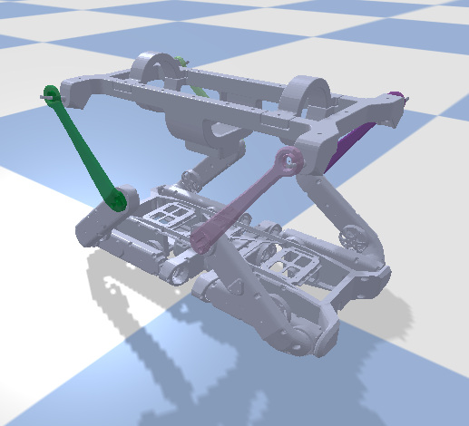
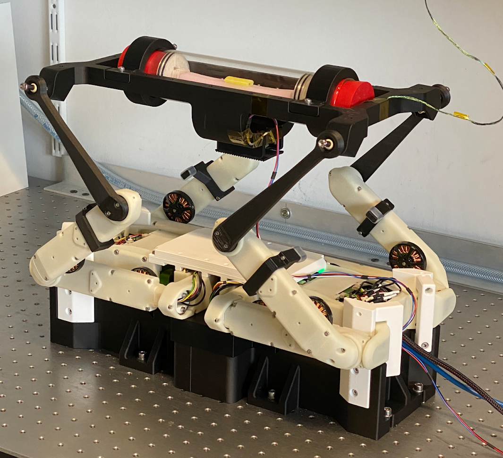
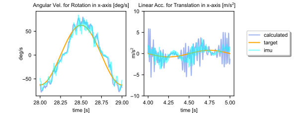
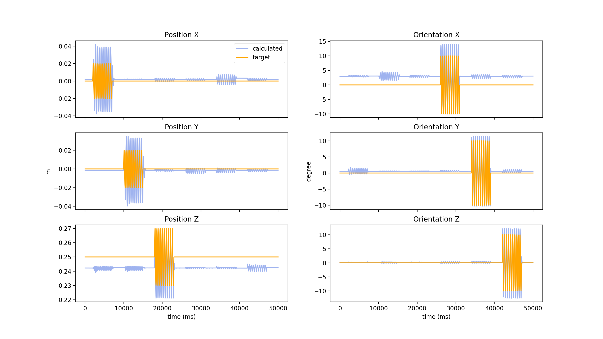

# Software Framework

Our open-source software package uses the master-board from the SOLO robot [Open Dynamic Robot Initiative GitHub page](https://github.com/open-dynamic-robot-initiative) to send torque commands to the motors and read sensor data. The [master-board](https://github.com/open-dynamic-robot-initiative/master-board) centralises all the sensor and actuator data and provides wired and wireless connection to a real-time computer. 

The primary language used in our software package is Python3. The software framework is built to be modular such that any user may update, add, or remove parts of the module. As long as the modules receive an input csv file of the proper format and output the respective csv files of proper format, the software framework will work as designed. 

Our software framework consists of 4 main modules:
1. [Platform Trajectory Generation](#platform-trajectory-generation)
2. [Inverse Kinematics Tool](#inverse-kinematics-tool)  
3. [Control Environment](#control-environment)  
4. [Post Processing](#post-processing)  

A flowchart showing a high-level overiew of the complete software framework is shown below:

  

## 1. Platform Trajectory Generation
The Platform Trajectory Generation module generates the target position and target orientation of the platform. A csv file is auto-generated containing a sequence of tx, ty, tz, rx, ry, and rz for translation and rotation in x, y and z respectively. The sequence starts with an initial waiting time of 2 seconds where the platform stays stable in the home position. The sequence is generated for a frequency of $240$ Hz for the PyBullet control environment and $1000$ Hz for the SOLO robot control environment (more details in [Control Environment](#control_environment)). 

The input parameters are given through CSV files located at: [`src/data_files/input_files/`](/src/data_files/input_files/).

We have implemented the following options for trajectory generation: 
- <b>Sine Trajectory Generation:</b> The sine trajectory generation generates a sequence of platform target positions and orientations by taking in the run time for the sequence (seconds), the waiting time after the completion of the sequence (seconds), the direction of movement (x/y/z), the motion type (translation/rotation), the frequency of the sine wave (Hz), the amplitude of the sine wave (mm/deg), and offsets in x, y, and z (mm) axis in case the user wants to modify the axis of translation/rotation. A list of multiple sine sequence inputs can be specified by the user in the same input csv file. 
- <b>Arbitrary Trajectory Generation:</b> The arbitrary trajectory generation generates a sequence of platform target positions and orientations by taking in a sequence of target positions (mm), target orientations (deg), and interpolation times (seconds) with respect to the home position. The trajectory is generated by doing a smooth linear interpolation between the desired target positions and orientations with the specified time of interpolation.  
- <b>Step Trajectory Generation:</b> The step trajectory generation generates a sequence of platform target positions and orientations by taking in a single line of platform end target position (mm) and orientation (deg). The generated trajectory contains a sudden change (in 1 ms) in target position and orientation to generate a step function. This is can be used for tuning the controller. 
- <b>Circular Trajectory Generation:</b> The circular trajectory generation generates a sequence of platform target positions and orientations such that the platform translates and rotates in a circular movement by taking in the radius of translation (mm), the angle of rotation (deg), the number of rounds, the frequency of rotation in each round, the translation and rotation direction (clock-wise/counter-clock-wise), and a flag to enable and/or disable translation and rotation. 

<b>Input:</b> CSV file according to required trajectory at [`src/data_files/input_files/`](/src/data_files/input_files/).  
<b>Output:</b> CSV file with desired target platform position and orientation auto-generated at [`src/data_files/auto_generated/traj_platform.csv`](../src/data_files/auto_generated/traj_platform.csv).  

## 2. Inverse Kinematics Tool
The Inverse Kinematics Tool module takes the auto-generated csv file of platform trajectories generated from section [Platform Trajectory Generation](#platform-trajectory-generation) as the input and calculates the target joint angles for each joint using inverse kinematics. We are using PyBullet for the inverse kinematics calculation. A new csv file is auto-generated that stores the target joint angles for each joint of the SOLO robot. 

<b>Input:</b> Auto-generated CSV file with desired target platform position and orientation from [Platform Trajectory Generation](#platform-trajectory-generation) at [`src/data_files/auto_generated/traj_platform.csv`](../src/data_files/auto_generated/traj_platform.csv).  
<b>Output:</b> CSV file with desired target joint angles for SOLO robot [`src/data_files/auto_generated/traj_joints.csv`](../src/data_files/auto_generated/traj_joints.csv).  

## 3. Control Environment
The Control Environment module takes the auto-generated csv file of target joint angles generated from Section [Inverse Kinematics Tool](#inverse-kinematics-tool) as the input. The controller uses the target joint angles and actual joint angles in order to give torque commands to the motors. Our software framework contains two control environments:
- <b>PyBullet Simulation Environment:</b> The PyBullet Simulation Environment (shown in figure to the left below) runs the 6 DoF SOLO motion platform in $240$ Hz (as it is limited by PyBullet). The simulation environment loads the URDF models of the SOLO robot and the sensor platform and creates constraints between the foot joints and the platform corners. The PyBullet simulation can be used to test various new algorithms and implementations without using the actual SOLO robot.  
- <b>SOLO Environment:</b> The SOLO Environment (shown in figure to the right below) runs the 6 DoF SOLO motion platform (physical) in $1000$ Hz. The SOLO environment initializes the SOLO robot (according to the master-board code), calibrates the SOLO robot (more details shared in [setup_and_usage.md](setup_and_usage.md), executes the desired motion trajectory, and reads/stores the IMU, motors, and sensor data. The PD controller gains can be updated if required. 

  
   

<b>Input:</b> CSV file with desired target joint angles for SOLO robot from [Inverse Kinematics Tool](#inverse-kinematics-tool) at [`src/data_files/auto_generated/traj_joints.csv`](../src/data_files/auto_generated/traj_joints.csv).  
<b>Output:</b> Robot motion (simulation or physical) and CSV file with all data collected at [`src/data_files/output_files`](../src/data_files/output_files). 

## 4. Post Processing
The final module in the software architecture is the Post Processing module. The Post Processing module contains two main parts:
- <b>Data Processing:</b> The Data Processing module reads and loads the data csv files saved in tbe above sections. A method to calculate the position and orientation at the center of the platform based on the robot joint angles using forward kinematics has been implemented. The linear and angular velocity and linear and angular acceleration of the platform is also derived using the position and orientation of the platform. This provides the option for a user to get the position, velocity, and acceleration at the platform without investing in an expensive IMU. We use these calculations in order to test and compare with the IMU data. The calculated platform position, orientation, linear velocity, angular velocity, linear acceleration, and angular acceleration are filtered using a butter lowpass filter of fixed cutoff frequency of $50$ Hz and sample frequency of $1000$ Hz in order to get smoother results. In addition, methods to transform the IMU data (angular velocity and linear acceleration) from the IMU position to the center of the platform is also present as this is essential for our research. The  Depending on the project and desired results, this section can be used, modified, or ignored. A zoomed-in plot showing the calculated, target, and measured IMU angular velocity for rotation in x-axis and translation in x-axis is shown below. All data is stored into a csv file that can be updated by the user based on the research, project, available resources, and desired outcome. The data preview module is loaded automatically after.

  

- <b>Data Preview:</b> The Data Preview module is responsible of loading data from the stored csv files and plotting plots and graphs depending on the research, project, and desired outcome. The data preview module is called automatically at the end of the program. It can also be executed independently for quick visualization of the latest data. An example summary plot showing the calculated and target platform position and orientation when commanded x,y,z translation and rotation is shown below.

  

<b>Input:</b> CSV file with all data collected from [Control Environment](#control-environment) at [`src/data_files/output_files`](../src/data_files/output_files).  

<b>Output:</b> Summary Plots and Graphs. 